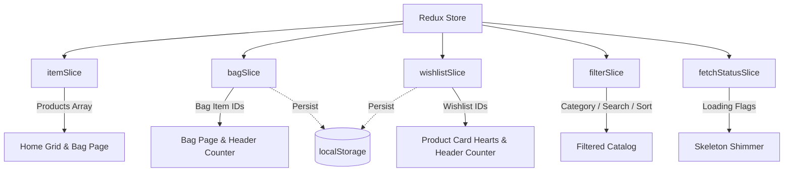

<div align="center">
  <br />
  <h1>✨ TrendVogue</h1>
  <p><strong>A Modern, High-Performance E-Commerce Web Application built with React 18, Redux Toolkit & Vite.</strong></p>

  [](https://react.dev/)
  [](https://redux-toolkit.js.org/)
  [](https://reactrouter.com/)
  [](https://vitejs.dev/)
</div>

<br />

---

## 📖 Table of Contents

- [Overview](#-overview)
- [Key React & Architecture Highlights](#-key-react--architecture-highlights)
- [Features](#-features)
- [Component Hierarchy](#-component-hierarchy)
- [Redux State Architecture](#-redux-state-architecture)
- [Design System & CSS Styling](#-design-system--css-styling)
- [Tech Stack](#-tech-stack)
- [Project Directory Structure](#-project-directory-structure)
- [Getting Started](#-getting-started)
- [Available Scripts](#-available-scripts)
- [Roadmap](#-future-roadmap)

---

## 🌟 Overview

**TrendVogue** is a full-featured e-commerce fashion storefront crafted to demonstrate modern React best practices. Built from the ground up to replace outdated monolithic clone architectures, it features:

- Ultra-fast client-side routing with **React Router v6**
- Clean, centralized state management with **Redux Toolkit**
- Custom CSS design system inspired by top fashion retail platforms
- Zero layout thrashing, responsive grid layouts, and smooth micro-interactions
- Instant search, category filtering, and multi-tier sorting with zero latency

---

## ⚛️ Key React & Architecture Highlights

### 1. Granular Redux Toolkit Slices
State is segregated into domain-specific slices for maintainability and predictable updates:
- **`itemSlice`**: Handles fetched catalog products.
- **`bagSlice`**: Manages cart additions, removals, and checkout clearing with automatic `localStorage` synchronization.
- **`wishlistSlice`**: Tracks favorited product IDs across sessions via persistent browser storage.
- **`filterSlice`**: Centralizes active category pills, dynamic search query inputs, and sort orders across components.
- **`fetchStatusSlice`**: Tracks asynchronous request lifecycle flags (`currentlyFetching`, `fetchDone`) to drive loading states.

### 2. Custom React Toast Context (`Toast.jsx`)
Instead of pulling heavy third-party notification libraries, TrendVogue uses a custom React Context provider (`ToastProvider` & `useToast` hook) that exposes a lightweight, animated notification system anywhere across the component tree.

### 3. Graceful Asynchronous Fetching with AbortController
The `FetchItems` component uses React `useEffect` with native `AbortController` signals to cancel in-flight HTTP requests when components unmount, eliminating memory leaks and race conditions.

### 4. Skeleton Shimmer UI for Perceived Performance
Replaced standard circular spinners with animated CSS skeleton product cards matching the layout structure of product cards.

---

## 🛍️ Features

- 💎 **Modern Hero Banner**: Highlighting current promotions, value propositions, and delivery guarantees.
- 🎯 **Interactive Category Tabs**: One-click filtering across Men, Women, Kids, Home & Living, and Beauty.
- 🔍 **Real-Time Live Search**: Instant multi-attribute search filtering by brand or product title with an instant clear button.
- ↕️ **Smart Catalog Sorting**:
  - Recommended
  - Price: Low to High
  - Price: High to Low
  - Customer Rating
  - Highest Discount
- 💖 **Wishlist System**: Floating one-click wishlist buttons on product cards linked to a dynamic header badge.
- 🛒 **Persistent Shopping Bag**: Add/remove products seamlessly; state persists on page refresh.
- 🏷️ **Dynamic Discount & Coupons**: Built-in promo coupon code (`VOGUE200`) with real-time bill deduction, savings banners, and convenience fee calculation.
- 📱 **Fully Responsive**: Tailored breakpoints for seamless experiences on mobile, tablet, and desktop screens.

---

## 🧩 Component Hierarchy

```text
<Provider store={store}>
  └── <RouterProvider>
        └── <App>                        (Root Layout)
              ├── <ToastProvider>        (Context Provider)
              ├── <Header />             (Navigation, Search Bar & Counters)
              ├── <FetchItems />         (Async Fetch Controller)
              ├── <Outlet />             (React Router)
              │     ├── <Home>           (Route: "/")
              │     │     ├── Hero Banner
              │     │     ├── Catalog Toolbar (Categories & Sort)
              │     │     ├── <HomeItem /> (Product Cards Grid)
              │     │     └── <Loading /> (Skeleton Shimmer)
              │     └── <Bag>            (Route: "/bag")
              │           ├── <BagItem /> -> <Item />
              │           ├── <BagSummary /> (Price Breakdown & Coupon)
              │           └── <BagMessage /> (Empty Bag State)
              └── <Footer />             (Trust Badges, Columns & Links)
```

---

## 🧠 Redux State Architecture



---

## 🎨 Design System & CSS Styling

The visual layer is powered by **Vanilla CSS tokens** (no Tailwind dependency), giving complete fine-grained control:

- **Typography**: Google Fonts [`Plus Jakarta Sans`](https://fonts.google.com/specimen/Plus+Jakarta+Sans) & [`Inter`](https://fonts.google.com/specimen/Inter)
- **Palette**:
  - Primary Brand: `#ff3f6c` (Pink)
  - Secondary Accent: `#ff905a` (Orange)
  - Success / Discounts: `#03a685` (Green)
  - Dark Typography: `#282c3f`
  - Subdued / Muted: `#535766`
- **Micro-Animations**:
  - CSS card elevations on hover (`transform: translateY(-4px)`)
  - Smooth image zoom (`transform: scale(1.05)`)
  - Keyframe-driven shimmer loading gradients
  - Spring toast notifications (`slideInUp`)

---

## 💻 Tech Stack

### Frontend
- **Library**: React 18.2.0
- **Build Tool**: Vite 5.0.8
- **State Management**: Redux Toolkit 2.0.1 & React-Redux 9.0.4
- **Routing**: React Router DOM 6.21.1
- **Icons**: React Icons (FontAwesome 6, Heroicons 2, Remix Icons, Ionicons 5)
- **CSS**: Custom Design Tokens with Bootstrap 5 reset grid

### Backend (API Service)
- **Runtime**: Node.js
- **Framework**: Express.js
- **Features**: RESTful `/items` endpoints, query-based category filtering, price/rating sorting, CORS enabled

---

## 📁 Project Directory Structure

```text
trendvogue-store/
├── 2-actual-backend/              # Express API Server
│   ├── data/
│   │   └── items.js               # File I/O operations
│   ├── app.js                     # Express routes & controllers
│   ├── items.json                 # Products catalog dataset
│   └── package.json
│
├── myntra/                        # React Frontend Application
│   ├── public/
│   │   ├── images/                # Product photography assets
│   │   └── vite.svg
│   ├── src/
│   │   ├── components/            # Reusable UI components
│   │   │   ├── BagItem.jsx        # Bag container & listing
│   │   │   ├── BagMessage.jsx     # Modern empty cart state
│   │   │   ├── BagSummary.jsx     # Bill details, coupons & order button
│   │   │   ├── FetchItems.jsx     # Data synchronization component
│   │   │   ├── Footer.jsx         # Trust strip & footer links
│   │   │   ├── Header.jsx         # Brand logo, nav & search input
│   │   │   ├── HomeItem.jsx       # Individual product card
│   │   │   ├── Item.jsx           # Individual cart item row
│   │   │   ├── Loading.jsx        # Skeleton shimmer placeholder
│   │   │   └── Toast.jsx          # Context-driven toast alerts
│   │   ├── routes/                # Route view components
│   │   │   ├── App.jsx            # Main app shell & layout wrapper
│   │   │   ├── Bag.jsx            # Cart / Bag checkout route
│   │   │   └── Home.jsx           # Storefront catalog route
│   │   ├── store/                 # Redux Toolkit configuration
│   │   │   ├── bagSlice.js        # Cart state & localStorage sync
│   │   │   ├── fetchStatusSlice.js# Request lifecycle state
│   │   │   ├── filterSlice.js     # Category, search, and sort state
│   │   │   ├── index.js           # configureStore setup
│   │   │   ├── itemSlice.js       # Products catalog slice
│   │   │   └── wishlistSlice.js   # Wishlist state & localStorage sync
│   │   ├── App.css                # Comprehensive design system
│   │   └── main.jsx               # React entry point
│   ├── index.html                 # HTML shell with Google Fonts
│   ├── package.json
│   └── vite.config.js
│
└── README.md
```

---

## 🚀 Getting Started

### Prerequisites
- [Node.js](https://nodejs.org/) (v16.x or later recommended)
- `npm` or `yarn`

### 1. Clone the Repository
```bash
git clone https://github.com/Pratik765/trendvogue-store.git
cd trendvogue-store
```

### 2. Start the Backend API
```bash
cd 2-actual-backend
npm install
node app.js
```
> The API server will start on **`http://localhost:8080`**.

### 3. Start the React Frontend
In a new terminal window:
```bash
cd myntra
npm install
npm run dev
```
> The Vite development server will start on **`http://localhost:5173`**.

---

## ⚡ Available Scripts

In the `myntra/` frontend directory, you can run:

| Command | Description |
| :--- | :--- |
| `npm run dev` | Starts Vite local development server with hot module replacement (HMR) |
| `npm run build` | Compiles and bundles production-ready assets into the `dist/` directory |
| `npm run preview` | Locally previews the production build output |
| `npm run lint` | Runs ESLint to check for code quality and syntax issues |

---

## 🗺️ Future Roadmap

- [ ] **Product Details View**: Dynamic routing (`/product/:id`) with multi-image gallery and size selector.
- [ ] **User Authentication**: Firebase or JWT-based login/register flow.
- [ ] **Address & Checkout Flow**: Multi-step checkout with address forms and payment gateway mock (Razorpay / Stripe).
- [ ] **Dark Mode Toggle**: CSS custom property theming switchable via header.
